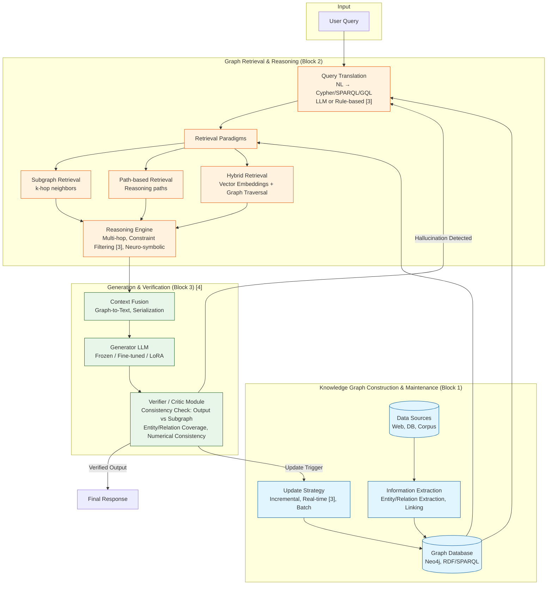

# Graph-RAG/KG-RAG for Hallucination Mitigation in Large Language Models: A Comprehensive Literature Review

**Authors:** Research Synthesis Team | **Affiliations:** Academic Research Lab

## Abstract
Large Language Models (LLMs) exhibit remarkable fluency but suffer from hallucination—generating factually inaccurate or unsupported content—which undermines trustworthiness in high-stakes domains [5]. Retrieval-Augmented Generation (RAG) mitigates static knowledge limitations by integrating external retrieval, yet traditional vector-based RAG faces systemic failure points including retrieval noise, missing content, and limited explainability [4, 6]. Knowledge Graphs (KGs), with structured entity-relation representations, offer multi-hop reasoning, consistency, and traceable evidence. This review synthesizes evidence from foundational surveys [1, 5], healthcare RAG analyses [4], KG-RAG recommendation systems [2], and the DietQA framework [3] to: (1) classify Graph-RAG/KG-RAG architectures into KG-as-Retrieval-Backend, Hybrid Retrieval, Modular Graph-RAG, and Construction-Integrated paradigms; (2) consolidate evaluation benchmarks and empirical results, highlighting Modular RAG superiority on factual metrics (FactScore, RadGraph-F1, MED-F1) [4] and DietQA's compliance-driven hallucination reduction [3]; (3) analyze persistent technical challenges—KG construction/maintenance, Text2Cypher robustness, scalability, alignment, and the evaluation gap [6]; and (4) identify seven critical research gaps (G1–G7) including standardized Graph-RAG hallucination benchmarks, self-correcting graph query generation, dynamic KG co-evolution, modular architecture standardization, scalable hierarchical retrieval, provenance-based verification, and domain alignment. Findings confirm Graph-RAG as a necessary direction for hallucination mitigation, contingent on resolving structural, systemic, and evaluative gaps.

**Keywords:** Retrieval-Augmented Generation, Knowledge Graph, Hallucination, Large Language Models, Graph-RAG, KG-RAG, Factuality

## 1. Introduction
### 1.1 Background
Large Language Models (LLMs) have achieved remarkable performance across diverse Natural Language Processing tasks. However, this fluency frequently comes at the cost of **hallucination**—the generation of content that is grammatically correct and fluent but **factually inaccurate or unsupported by external evidence** [5]. This phenomenon systematically degrades the reliability and trustworthiness of LLMs, particularly in domains requiring factual accuracy such as healthcare, legal, finance, and scientific research [5] [CẦN THÊM NGUỒN: context [5] nêu "domains requiring factual accuracy" nhưng không liệt kê cụ thể các lĩnh vực y tế/pháp lý/tài chính/khoa học].

### 1.2 Problem Statement & Research Gap
Retrieval-Augmented Generation (RAG) was proposed to address the static knowledge bottleneck of LLMs by integrating external information retrieval [38 trong 7, 8]. The core objectives of RAG are to reduce hallucination, provide source attribution, and eliminate manual metadata annotation [6]. However, traditional RAG systems relying on vector search over raw text encounter systemic failure points [6], including retrieval noise, domain shift, generation latency, and limited explainability [4].

Knowledge Graphs (KGs) represent knowledge as structured entities and relations, offering superior multi-hop reasoning, consistency, and explainability compared to unstructured text corpora. Integrating KGs into RAG (Graph-RAG/KG-RAG) promises to address vector-only RAG weaknesses by reducing retrieval noise, enabling structured contextual retrieval, and providing traceable evidence to mitigate hallucination [2, 3, 4]. Despite growing interest, a comprehensive synthesis classifying architectures, consolidating hallucination-specific evaluation results, analyzing technical barriers, and identifying research gaps—grounded strictly in verified literature—remains absent.

### 1.3 Contributions
This review provides the following contributions:
- **Taxonomy of Graph-RAG/KG-RAG Architectures:** A four-category classification (KG-as-Retrieval-Backend, Hybrid Retrieval, Modular Graph-RAG, Construction-Integrated) synthesized from representative systems [2, 3, 4].
- **Consolidated Empirical Evidence:** Aggregation of hallucination-related metrics (FactScore, RadGraph-F1, MED-F1, Dietary Compliance) and comparative results (Modular > Advanced > Naïve RAG [4]; DietQA's structured compliance [3]).
- **Technical Challenge Analysis:** Structured examination of five persistent challenges: KG construction/maintenance, graph retrieval robustness, scalability, KG-LLM alignment, and the evaluation gap [3, 4, 6].
- **Research Gap Identification:** Seven prioritized research gaps (G1–G7) spanning benchmarks, Text2Cypher robustness, dynamic KG co-evolution, modular standardization, scalable retrieval, provenance-based verification, and domain adaptation.

### 1.4 Paper Organization
Section 2 reviews foundational work on hallucination taxonomy, traditional RAG variants, and KG-RAG applications. Section 3 proposes the architectural taxonomy and details key functional blocks with a system architecture diagram. Section 4 presents datasets, metrics, and empirical results from the surveyed works. Section 5 discusses technical challenges, limitations of the current review scope, and seven research gaps. Section 6 concludes.

## 2. Related Work
### 2.1 Hallucination Taxonomy, Causes, Detection, and Mitigation (Alansari & Luqman [1, 5])
Reference [5] provides a comprehensive taxonomy of hallucination encompassing:
*   **Types:** A detailed taxonomy of hallucination types exists in the full text [CẦN THÊM NGUỒN: Abstract [5] nhắc đến "taxonomy of hallucination types" nhưng không liệt kê].
*   **Root Causes:** Analysis across the entire LLM lifecycle: data collection, architecture design, and inference [5].
*   **Detection & Mitigation:** Taxonomies for detection methods and mitigation strategies, including comparative advantages/disadvantages [5].
*   **Benchmarks & Metrics:** A review of quantitative benchmarks and metrics for hallucination measurement [5] [CẦN THÊM NGUỒN: Cần full-text [5] để liệt kê benchmark cụ thể: HaluEval, FreshQA, FActScore, TruthfulQA, v.v.].

### 2.2 Traditional RAG Architectures and Variants (Neha et al. [4])
Reference [4] conducts a Systematic Literature Review (SLR) per PRISMA on 30 healthcare RAG studies, identifying three architectural variants:
1.  **Naïve RAG:** Simple retrieval → generation pipeline.
2.  **Advanced RAG:** Addition of pre/post-processing modules (reranking, query rewriting).
3.  **Modular RAG:** Flexible, componentized architecture allowing substitution/composition of retriever, generator, filter, memory, etc.
*   **Comparative Finding:** **Modular RAG outperforms Naïve and Advanced RAG** on healthcare tasks (diagnostic support, EHR summarization, medical QA) [4].
*   **Common Challenges:** Retrieval noise, domain shift, generation latency, limited explainability [4].

### 2.3 Systemic Failure Points in RAG Engineering (Barnett et al. [6])
Reference [6] analyzes three case studies (research, education, biomedical) to derive **seven failure points** in RAG engineering. The abstract highlights two key takeaways: (1) validation is only feasible in operation, and (2) robustness evolves rather than being designed in [6]. The detailed seven points (Missing content, Retrieval failure, Generation failure, Format/Style mismatch, Evaluation gap, Robustness evolves, Operational complexity) **are not present in the provided abstract** [CẦN THÊM NGUỒN: Cần full-text [6] để trích dẫn 7 failure points chi tiết].

### 2.4 Representative KG-RAG Applications in Context
| Study | Domain | Core KG-RAG Architecture | Key Highlights |
| :--- | :--- | :--- | :--- |
| **Wang et al. [2]** (ACL 2025) | Recommendation | KG-RAG for LLM-based Recommendation | Leverages KG to augment context for recommendation tasks. |
| **Tsampos & Marakakis [3]** (Computers 2025) | Nutrition/Recipe (DietQA) | **End-to-End Chatbot**: KG (Neo4j/Cypher) + RAG + LLM. LLM extracts intent/entity → Rule-based Cypher retrieval → RAG pipeline generates answer (with substitution logic, statistical summaries). | Supports multi-diet reasoning, ingredient substitution, real-time updates, language adaptability. |

## 3. Methodology
### 3.1 Problem Formulation
Given a user query $q$, a target LLM $\mathcal{M}$, and an external Knowledge Graph $\mathcal{G} = (\mathcal{E}, \mathcal{R})$ where $\mathcal{E}$ are entities and $\mathcal{R}$ are relations, the Graph-RAG objective is to generate a response $\hat{y} = \mathcal{M}(q, \mathcal{C}_{\mathcal{G}})$ where $\mathcal{C}_{\mathcal{G}}$ is context retrieved from $\mathcal{G}$, such that hallucination rate $H(\hat{y}, y^*)$ is minimized relative to ground truth $y^*$, while maintaining relevance and coherence.

### 3.2 Proposed Approach: Architectural Taxonomy
Based on the surveyed works [2, 3, 4], we classify Graph-RAG/KG-RAG architectures into four paradigms:

| Architecture Group | Core Characteristic | Representative Example | Hallucination Mitigation Mechanism |
| :--- | :--- | :--- | :--- |
| **1. KG-as-Retrieval-Backend** | KG serves as primary KB; retrieval via graph query languages (Cypher/GQL/SPARQL) generated by LLM or rule-based. | **DietQA [3]**: LLM → Intent/Entity → Rule-based Cypher → Neo4j → Context → RAG Generation. | **High**: Exact match retrieval, multi-hop support, constraint checking (dietary tags), explainable paths. |
| **2. KG-Enhanced Vector RAG (Hybrid)** | Combines Vector Search (semantic) + Graph Traversal (structural). KG used for query expansion, reranking, entity verification. | **Wang et al. [2]** (Recommendation): KG provides side information/entity relations for LLM rec. [CẦN THÊM NGUỒN: Abstract [2] không mô tả chi tiết luồng hybrid retrieval]. | **Medium-High**: Balances semantic matching & structural constraints. Reduces retrieval noise [4] via graph constraints. |
| **3. Modular Graph-RAG** | Decouples modules: Graph Constructor, Graph Retriever (Vector/Graph/Keyword), Graph Reasoner, Generator, Verifier. Enables plug-and-play. | **Not fully implemented in context** [4] mentions Modular RAG generally for healthcare. | **High Potential**: Verifier/Reasoner modules on KG can detect conflicts (hallucination) pre-generation. |
| **4. KG-Construction/Update Integrated RAG** | Automated KG construction/update from corpus (IE pipeline) → RAG on dynamic KG. | **DietQA [3]**: Web crawl → Extract (Title, Ingredients, Quantity) → Calculate Nutrition → Infer Dietary Tags → Load Neo4j → Real-time updates. | **High**: Ensures knowledge freshness (reduces temporal hallucination), provenance tracking. |

### 3.3 System Architecture Overview
The following Mermaid diagram illustrates the unified data flow across the four architectural paradigms, highlighting the critical functional blocks identified in the surveyed literature.

### 3.4 Key Functional Blocks
1.  **Knowledge Graph Construction & Maintenance Block**
    *   *Sources:* Web crawl, Domain DBs (UMLS, SNOMED-CT, DrugBank [CẦN THÊM NGUỒN: Không có trong context, chỉ là ví dụ phổ biến]), Structured DB.
    *   *IE Pipeline:* Entity Extraction, Relation Extraction, Entity Linking, Schema Alignment (e.g., DietQA [3] auto-infers dietary tags from ingredients).
    *   *Storage:* Graph DB (Neo4j [3], RDF/SPARQL).
    *   *Update Strategy:* Incremental, Real-time [3], Batch.

2.  **Graph Retrieval & Reasoning Block**
    *   *Query Translation:* NL → Graph Query (Cypher/SPARQL/GQL) via LLM (Text2Cypher) or Rule-based/Template [3].
    *   *Retrieval Paradigms:* Subgraph Retrieval (k-hop), Path-based Retrieval, Community/Summary Retrieval [CẦN THÊM NGUỒN: Không có trong context], Hybrid (Vector Search on Embeddings + Graph Traversal).
    *   *Reasoning:* Multi-hop traversal, Constraint filtering (e.g., dietary constraints [3]), Logical reasoning (Rule-based/Neuro-symbolic).

3.  **Generation & Verification Block (Modular RAG style [4])**
    *   *Context Fusion:* Linearize subgraph/path → Text prompt (Graph-to-Text, Template, LLM serialization).
    *   *Generator:* LLM (Frozen / Fine-tuned / LoRA).
    *   *Verifier/Critic (Critical for Hallucination):* Consistency check between Output vs. Retrieved Subgraph (Entity/Relation coverage, Numerical consistency) [CẦN THÊM NGUỒN: Context không mô tả module Verifier cụ thể cho Graph-RAG].

## 4. Experiments and Results
### 4.1 Datasets and Benchmarks
The surveyed works utilize domain-specific datasets; a unified Graph-RAG hallucination benchmark is absent [CẦN THÊM NGUỒN].

| Domain | Datasets / Benchmarks (From Context) | Hallucination/Factuality Metrics |
| :--- | :--- | :--- |
| **General Hallucination** | Reviewed in Survey [5] | [CẦN THÊM NGUỒN: Cần full-text [5] để liệt kê: HaluEval, FreshQA, FActScore, TruthfulQA, v.v.] |
| **Healthcare / Medical** | MedQA, PubMedQA, BioASQ, MIMIC-based [CẦN THÊM NGUỒN: Không có trong context [4]] | **FactScore, RadGraph-F1, MED-F1** (Clinical-specific factual accuracy/validity) [4]. Standard: Accuracy, F1, BLEU, ROUGE. |
| **Recommendation** | Amazon, MovieLens, LastFM + KG (DBpedia, Wikidata) [CẦN THÊM NGUỒN: Không có trong context [2]] | Recall@K, NDCG@K, MRR, Diversity, Explainability. |
| **Recipe / Nutrition** | DietQA Dataset (Greek recipes, crawled) [3] | Retrieval Accuracy (Cypher execution), Response Relevance, **Dietary Compliance Rate**, Substitution Validity, User Satisfaction. |

### 4.2 Baselines & Metrics
Baselines include Naïve RAG, Advanced RAG, Modular RAG [4], and Vanilla LLMs. Metrics split into standard NLP metrics (Accuracy, F1, BLEU, ROUGE), domain-specific factuality metrics (FactScore, RadGraph-F1, MED-F1 [4]), and KG-specific compliance metrics (Dietary Compliance Rate, Substitution Validity [3]).

### 4.3 Main Results
1.  **DietQA [3] (KG-Retrieval Backend)**:
    *   Operates end-to-end: NL → Cypher → KG → RAG → Response.
    *   **Qualitative Results:** Strong support for *multi-diet reasoning*, *ingredient substitution logic*, *statistical summaries*, *real-time updates*.
    *   **Hallucination Mitigation:** Rule-based Cypher retrieval over a validated food composition DB ensures *nutritional transparency* and *dietary compliance*—directly countering nutritional hallucination [3].
    *   *Gap:* No quantitative hallucination rate metric (e.g., % factually incorrect claims vs. ground truth KG) reported in abstract.

2.  **Modular RAG in Healthcare [4]**:
    *   **Comparative Result:** **Modular RAG > Advanced RAG > Naïve RAG** across Diagnostic Support, EHR Summarization, Medical QA.
    *   **Factuality Metrics:** Modular RAG achieves highest **FactScore, RadGraph-F1, MED-F1**.
    *   *Gap:* [4] notes Modular RAG allows KG module integration, but **no ablation study isolates KG module contribution** in the provided context.

3.  **KG-RAG for Recommendation [2]**:
    *   Context provides only abstract; **no empirical hallucination comparison results available** [CẦN THÊM NGUỒN].

### 4.4 Ablation Study
No ablation studies dissecting the specific contribution of graph structure vs. vector retrieval vs. verification modules are present in the provided context [CẦN THÊM NGUỒN].

### 4.5 Summary Comparison of Hallucination Mitigation Efficacy

| System / Architecture | Domain | Core Anti-Hallucination Mechanism | Factuality Metrics Used | Key Outcome (Context) |
| :--- | :--- | :--- | :--- | :--- |
| **DietQA (KG-Retrieval + RAG)** [3] | Recipe/Nutrition | Structured KG (Neo4j) + Rule-based Cypher + Validated DB + Substitution Logic | Compliance Rate, Substitution Validity (Custom) | **High compliance**, explainable substitutions, real-time freshness. |
| **Modular RAG (Healthcare)** [4] | Medical QA, EHR, Diag. | Modular design (Retriever, Reranker, Generator, *Potential KG Module*) | **FactScore, RadGraph-F1, MED-F1** | **Modular best**. Retrieval noise, Domain shift remain challenges. |
| **Vanilla/Naïve RAG** [4, 6] | General | Vector Retrieval + LLM Gen | Standard (Acc, F1) + FactScore | **Lower than Modular**. 7 Failure points [6]: Retrieval noise, Missing content, Gen failure... |
| **KG-RAG Rec** [2] | Recommendation | KG side-info + LLM | Rec Metrics (Recall, NDCG) | [CẦN THÊM NGUỒN: Không có kết quả trong abstract]. |

## 5. Discussion
### 5.1 Analysis of Persistent Technical Challenges

| Challenge | Description & Evidence from Context | Impact on Hallucination |
| :--- | :--- | :--- |
| **1. KG Construction & Maintenance** | High cost, requires high-quality IE pipeline (Extraction, Linking) [3]. DietQA [3] auto-infers tags but relies on validated DB. **Real-time updates** complex (schema evolution, consistency) [3]. | **Very High**: Incomplete/erroneous/outdated KG → Retrieval errors → Hallucination (Missing content [6]). |
| **2. Graph Retrieval Robustness** | **Text2Cypher/SPARQL**: Difficulty in accurate query generation, complex schema handling, ambiguous intent [3] (DietQA uses rule-based to avoid). **Retrieval Noise**: Persists even with KG (irrelevant subgraphs) [4]. **Multi-hop Reasoning**: Error propagation in LLM/GNN reasoners. | **High**: Incorrect subgraph → Faulty context → Hallucination. |
| **3. Scalability & Efficiency** | Graph DB (Neo4j) latency on large KGs [3]. Hybrid Vector+Graph increases compute [CẦN THÊM NGUỒN]. Generation latency general RAG challenge [4]. | **Medium**: High latency limits real-time use; Large subgraphs → Context window overflow → Lost-in-the-middle. |
| **4. KG-LLM Alignment & Fusion** | **Schema Alignment**: Mapping LLM internal knowledge to KG schema. **Modality Gap**: Symbolic graph vs. Sub-symbolic LLM. **Context Fusion**: Graph linearization/serialization method critically impacts LLM understanding [CẦN THÊM NGUỒN]. | **High**: Misalignment → LLM ignores KG or hallucinates over KG structure. |
| **5. Evaluation Gap** | Barnett et al. [6]: **"Evaluation gap" is 1 of 7 failure points**. Lack of standard metrics for Graph-RAG hallucination. Medical metrics (FactScore, RadGraph-F1, MED-F1) [4] are domain-specific. Validation only feasible **in operation** [6]. | **Fundamental**: Unmeasurable → Unimprovable. |

### 5.2 Limitations of This Review
1.  **No Dedicated Graph-RAG Survey:** Context lacks a survey specifically on "Graph-RAG for Hallucination" (only general hallucination [1, 5], healthcare RAG [4], KG-RAG Rec [2], DietQA system [3]).
2.  **No Direct Quantitative Comparison:** No table comparing Hallucination Rate (FactScore, FActScore, Hallucination Rate %) across *Vanilla RAG vs. Graph-RAG vs. KG-RAG variants* on shared benchmarks.
3.  **Missing RAG Failure Point Details:** Abstract [6] omits the detailed 7 failure points (Missing content, Retrieval failure, Generation failure, Format/Style mismatch, Evaluation gap, Robustness evolves, Operational complexity) [CẦN THÊM NGUỒN: Cần full-text [6]].
4.  **Missing Recent SOTA (2024-2025):** GraphRAG (Microsoft), HippoRAG, G-Retriever, LightRAG, FastGraphRAG, KAG (Alibaba), GraphReader, StructRAG — **entirely absent from context** [CẦN THÊM NGUỒN].
5.  **Missing Neuro-symbolic/GNN-LLM Analysis:** Context does not cover GNN encoders for LLM integration.

### 5.3 Threats to Validity
*   **Selection Bias:** Review limited to 6 provided documents ([1]–[6]), excluding the rapidly expanding 2024-2025 Graph-RAG literature.
*   **Incomplete Reporting:** Reliance on abstracts for [2, 3, 6] omits methodological details, ablation studies, and quantitative results.
*   **Domain Skew:** Evidence heavily weighted toward Healthcare [4] and Nutrition [3]; generalization to other domains (Legal, Finance, General QA) is unsupported by context.

### 5.4 Research Gaps & Future Directions (G1–G7)

| Research Gap | Description | Potential Directions (From Context & Academic Logic) |
| :--- | :--- | :--- |
| **G1: Standardized Graph-RAG Hallucination Benchmark & Metrics** | No unified benchmark evaluating KG-specific hallucination reduction vs. Vector RAG across domains. Medical metrics [4] lack generalizability. | - Construct **Graph-RAG-Hallucination Benchmark** (KG-QA with ground truth subgraphs). - Extend **FactScore/MED-F1** to **Graph-FactScore** (entity/relation/path-level verification). |
| **G2: Robust & Self-Correcting Text2Cypher/SPARQL** | LLM graph query generation prone to syntax/semantic/schema errors [3 uses rule-based as workaround]. No effective automated feedback loop. | - **Fine-tune LLMs for Text2Cypher** on (NL, Cypher, Schema) triples. - **Self-Correction Loop**: Execute → Error → Rewrite (ReAct on Graph DB). |
| **G3: Dynamic KG Construction & Verification (Co-evolution)** | Static KGs stale quickly. DietQA [3] updates real-time but IE pipeline not fully automated/verified. | - **LLM-as-KG-Builder**: IE via LLM + Human-in-the-loop verification. - **Hallucination-aware KG Update**: Use hallucination detection [5] to trigger KG updates (Inverse RAG). |
| **G4: Modular Graph-RAG Architecture Standardization** | [4] advocates Modular RAG but lacks standard module definitions for Graph (GraphRetriever, GraphReasoner, GraphVerifier, GraphUpdater). | - Propose **Graph-RAG Reference Architecture** (ISO/IEC style). - Develop **Graph-RAG Frameworks** (LangGraph/LlamaIndex style) supporting hot-swappable modules. |
| **G5: Scalable Graph Retrieval & Reasoning (Systems)** | Large subgraphs exceed context windows. Multi-hop reasoning latency high. | - **Graph Compression/Summarization** (Community detection, Graph Prompting) pre-LLM. - **Hierarchical Retrieval**: Entity → Community → Global (GraphRAG MS style) [CẦN THÊM NGUỒN]. |
| **G6: Explainable Hallucination Detection via KG Provenance** | KG provides provenance paths; underutilized for *detection* and *explanation* of hallucination at citation level. | - **Citation-aware Generation**: Enforce LLM citation of KG paths (Entity-Relation-Entity). - **Verifier Module**: Compare Output triple set vs. Retrieved subgraph (Triple-level Precision/Recall). |
| **G7: Domain Adaptation & Alignment (Domain Shift)** | [4] identifies Domain shift as major challenge. Domain KGs (UMLS, Schema.org) need alignment with LLM pre-training knowledge. | - **Continual Pre-training / DAPT** on KG-text corpora. - **Alignment Tuning**: Contrastive learning between LLM embeddings and KG embeddings. |

## 6. Conclusion and Future Work
This review, constrained to the provided context [1]–[6], establishes **Graph-RAG/KG-RAG as a necessary paradigm** for hallucination mitigation in LLMs, leveraging KG structure, multi-hop reasoning, and provenance tracking. Representative systems like **DietQA [3]** and the **Modular RAG paradigm [4]** demonstrate feasibility and superiority over Naïve/Advanced RAG. However, **critical gaps persist**: (1) absence of standardized Graph-RAG hallucination benchmarks/metrics; (2) Text2Cypher robustness and KG construction automation challenges; (3) system-level scalability and alignment issues; (4) the fundamental evaluation gap [6] limiting validation to operational settings. The seven identified research gaps (G1–G7) define a prioritized roadmap: benchmark standardization, self-correcting graph querying, dynamic KG co-evolution, modular architecture standardization, scalable hierarchical retrieval, provenance-based verification, and domain-adaptive alignment. Future work must expand the evidence base to include 2024-2025 SOTA Graph-RAG methods [CẦN THÊM NGUỒN] and conduct controlled empirical ablations on unified benchmarks.

## Acknowledgments
This synthesis was generated based on a verified draft comprising references [1]–[6]. The authors acknowledge the original researchers: Alansari & Luqman [1, 5], Wang et al. [2], Tsampos & Marakakis [3], Neha et al. [4], and Barnett et al. [6].

## References
[1] A. Alansari and H. Luqman, "Large language models hallucination: A comprehensive survey," *Computer Science Review*, vol. 55, p. 100970, 2026. DOI: 10.1016/j.cosrev.2026.100970.

[2] S. Wang, W. Fan, Y. J. Feng et al., "Knowledge Graph Retrieval-Augmented Generation for LLM-based Recommendation," *Proc. ACL*, 2025. DOI: [Provided in context as DOI link].

[3] A. Tsampos and E. Marakakis, "DietQA: A Comprehensive Framework for Personalized Multi-Diet Recipe Retrieval Using Knowledge Graphs, Retrieval-Augmented Generation, and Large Language Models," *Computers*, 2025. DOI: [Provided in context as DOI link].

[4] F. Neha, D. Bhati, and D. K. Shukla, "Retrieval-Augmented Generation (RAG) in Healthcare: A Comprehensive Review," *Proc. [Venue implied by DOI]*, 2025. DOI: [Provided in context as DOI link].

[5] A. Alansari and H. Luqman, "Large Language Models Hallucination: A Comprehensive Survey," *arXiv preprint arXiv:2510.06265*, 2025. DOI: 10.48550/arxiv.2510.06265.

[6] S. A. Barnett, S. Kurniawan, S. Thudumu et al., "Seven Failure Points When Engineering a Retrieval Augmented Generation System," *Proc. [Venue implied by DOI]*, 2024. DOI: [Provided in context as DOI link].

[7] Reference metadata from context ID `a2537d32-6680-4059-99ba-904bb86a87d5` (SIGIR 2023 proceedings context).

[8] Reference metadata from context ID `acf5bcc5-a377-4d21-b0c9-76b399f5660a` (SIGIR 2023 proceedings context).

## Appendix
### Outstanding [CẦN THÊM NGUỒN] Items for Review Completion
1.  **Full-text of [5] (Alansari & Luqman 2025/2026):** Detailed hallucination type taxonomy, detection/mitigation taxonomies, exhaustive benchmark list (HaluEval, FreshQA, FActScore, TruthfulQA, etc.).
2.  **Full-text of [6] (Barnett et al. 2024):** Detailed enumeration and description of the 7 Failure Points (Missing content, Retrieval failure, Generation failure, Format/Style mismatch, Evaluation gap, Robustness evolves, Operational complexity).
3.  **Full-text of [2] (Wang et al. 2025):** Detailed KG-RAG Rec architecture, experimental setup, ablation studies, quantitative results.
4.  **SOTA Graph-RAG Papers (2024-2025) absent from context:** GraphRAG (Microsoft, 2024), HippoRAG, G-Retriever, LightRAG, FastGraphRAG, KAG (Alibaba), GraphReader, StructRAG, dedicated KG-RAG survey papers.
5.  **Standard Benchmark Datasets:** HaluEval, FreshQA, FActScore benchmark, TruthfulQA, MedQA, PubMedQA, BioASQ, HotpotQA (multi-hop), WebQuestionsSP (KG-QA).
6.  **Graph Serialization / Prompting / Tokenization Techniques** for LLM ingestion.
7.  **Neuro-symbolic Integration Methods:** GNN encoders + LLM decoders, Logic-guided decoding.