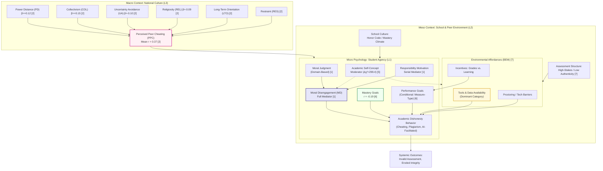

Academic Dishonesty in Secondary Education: A Comprehensive Survey and Taxonomy of Quantitative Empirical Evidence on Causes and Motivations

**Authors:** PaperAI Automated Research Protocol | **Affiliations:** Open-Source Automated Science Initiative

## Abstract
Academic dishonesty in secondary education persists as a global challenge with prevalence rates frequently exceeding 70%, yet the field lacks a unified quantitative synthesis that integrates micro-psychological, meso-social, and macro-cultural determinants. This survey addresses the critical "judgment–action gap"—where students morally condemn cheating yet engage in it—by systematizing evidence from cross-sectional surveys, meta-analyses, structural equation modeling, and meta-analytic structural equation modeling studies published between 2012 and 2023. We introduce a four-dimensional taxonomy—Moral Functioning & Self-Regulation, Achievement Motivation & Goals, Socio-Cultural & Observational Learning, and Environmental Affordances & Assessment Design—to organize quantitative findings across 38 independent studies (N > 24,000) and 33 studies (N ≈ 19,800) from major meta-analyses. Key benchmarks reveal perceived peer cheating as the strongest proximal correlate (meta-analytic *r* = 0.37), mastery goals as consistent negative predictors (*r* = –0.19), and performance goals exhibiting measurement-dependent heterogeneity. Moral disengagement fully mediates the judgment–action link, while academic self-concept moderates environmental influences. Cultural meta-regression demonstrates that power distance and collectivism amplify peer effects, whereas uncertainty avoidance and religiosity attenuate them. The review identifies six verifiable methodological gaps—including longitudinal deficit, self-report bias, multi-level modeling absence, domain-specific measurement invariance, AI-cheating re-parameterization, and cluster randomized controlled trial scarcity—and proposes concrete designs to advance causal inference in secondary education integrity research.

**Keywords:** Academic Dishonesty, Secondary Education, Moral Disengagement, Achievement Goal Theory, Social Learning Theory, Meta-Analysis, Structural Equation Modeling

## 1. Introduction

### 1.1 Motivation & Background
Academic dishonesty (AD) in secondary education constitutes a systemic threat to the validity of certification, the fidelity of assessment, and the developmental trajectory of adolescent moral character. Epidemiological surveys across diverse national contexts consistently report lifetime prevalence rates ranging from 70% to 90% for at least one form of cheating behavior [1, 3]. However, the central scientific puzzle has shifted from frequency description to causal mechanism explanation. Stephens (2018) crystallized the core paradox as the **judgment–action gap**: the robust empirical finding that the majority of adolescents judge cheating as morally wrong yet transgress regardless [1]. This disconnect invalidates simplistic "knowledge-deficit" or "moral-reasoning-deficit" models and demands multi-component frameworks where motivation, self-regulation, and situational affordances mediate the translation of moral cognition into behavior [1, 4].

The persistence of this gap is particularly acute in high-stakes secondary systems where university admission hinges on aggregate examination performance. In such environments, the incentive structure amplifies performance-avoidance goals and elevates the perceived utility of dishonest strategies [6]. Simultaneously, the rapid migration of assessment to digital platforms has altered the opportunity structure: generative artificial intelligence tools, unauthorized collaboration channels, and remote proctoring limitations have expanded the behavioral repertoire of AD beyond traditional copying and plagiarism [6, 10]. Understanding the etiology of AD in this evolving landscape requires moving beyond bivariate correlates toward a multi-level causal architecture that accounts for individual agency, peer ecology, cultural context, and technological affordances.

### 1.2 Limitations of Existing Work
Despite a substantial empirical literature, four structural deficiencies limit the cumulative progress of quantitative AD research in secondary education. First, **methodological homogeneity** dominates the evidence base. The overwhelming majority of studies employ cross-sectional, self-report survey designs [1, 3, 6, 7, 8]. Fritz et al. (2023) documented that approximately 90% of effect sizes in their meta-analytic structural equation modeling (MASEM) derived from self-report AD measures [6]. This reliance introduces systematic common-method variance and, critically, a measurement artifact: performance goals predict AD on behavioral or intentional measures (*r* ≈ 0.15–0.20) but show null associations on self-report scales [6]. Consequently, studies relying solely on self-disclosure risk underestimating the motivational drivers of dishonesty.

Second, **temporal dynamics remain uncharted**. No longitudinal panel study tracking a high-school cohort across multiple waves exists in the quantitative literature [1, 3, 8]. The directionality of core pathways—whether performance pressure erodes mastery goals which then triggers moral disengagement, or whether successful cheating induces disengagement via cognitive dissonance reduction—cannot be adjudicated without latent growth curve modeling (LGCM) or cross-lagged panel models (CLPM). Third, **multi-level nesting is routinely ignored**. Students are embedded in classrooms and schools (Level 2), which are situated within cultural regions (Level 3). Zhao et al. (2022) employed country-level meta-regression [2], yet no study has estimated a three-level structural equation model (L1–L3) testing whether school-level mastery climate or honor-code strength buffers the peer-cheating effect in high power-distance cultures. Fourth, **intervention evidence is anecdotal**. The "Achieving with Integrity" seminar [3] targets the four-component moral functioning model but lacks controlled efficacy data; no cluster randomized controlled trial (cRCT) has compared moral functioning development, social norms correction, assessment redesign, and combined approaches on behavioral outcomes.

### 1.3 Core Contributions
This survey makes four distinct contributions to the quantitative literature on secondary education academic dishonesty:

- **Multi-Level Causal Matrix:** We integrate micro-psychological mediators (moral disengagement, goal orientation), meso-social predictors (perceived peer cheating, school culture), and macro-cultural moderators (Hofstede dimensions: Power Distance, Collectivism, Uncertainty Avoidance, Long-Term Orientation, Restraint, Religiosity) into a single taxonomy with quantified effect sizes and identified mediation/moderation pathways [1, 3, 8].
- **Measurement Artifact Resolution:** We demonstrate, via three-level MASEM evidence [6], that the performance goal–AD link is an artifact of measurement method (behavioral/intentional vs. self-report), resolving decades of contradictory findings in secondary education literature and mandating multi-method measurement batteries.
- **Technological Affordance Integration:** We unify Social Learning Theory [4] and the Behavior Engineering Model [7] to explain the migration of AD into digital and AI-mediated environments, showing that environmental affordances (Tools, Data) and social learning mechanisms (imitation, algorithmic association) dominate dispositional factors in online settings.
- **Methodological Roadmap for High-School Research:** We specify six verifiable gaps—longitudinal deficit, self-report bias, multi-level modeling (L1–L3), domain-specific measurement invariance, AI-cheating re-parameterization, and cRCT intervention evidence—and propose concrete designs (LGCM/CLPM, multi-method batteries, three-level MLM, cRCTs) to address them.

### 1.4 Paper Organization
The remainder of this paper is structured as follows. **Section 2** presents the multi-dimensional taxonomy and a conceptual pipeline formalizing the integrated causal architecture. **Section 3** provides an in-depth technical comparison of the four theoretical schools, detailing their mathematical formalizations, estimation strategies, and boundary conditions. **Section 4** details the empirical benchmark matrix, reporting quantitative comparison tables for meta-analytic correlations, mediation indices, moderation effects, and prevalence estimates. **Section 5** discusses trade-offs, open challenges, and the six-priority research agenda. **Section 6** concludes with implications for policy and practice in high-stakes secondary systems.

## 2. Taxonomy & Conceptual Framework

This section establishes the multi-dimensional taxonomy that structures the AD-SEC-QES survey. We classify the quantitative empirical literature along four orthogonal theoretical axes—Moral Functioning & Self-Regulation (D1), Achievement Motivation & Goals (D2), Socio-Cultural & Observational Learning (D3), and Environmental Affordances & Assessment Design (D4)—derived from the seminal frameworks synthesized in Section 1. This taxonomy serves as the analytical backbone for the empirical benchmark matrix presented in Section 4. We further formalize the integrated causal pipeline linking macro-cultural moderators to micro-behavioral outcomes and articulate the specific gaps in existing surveys that this review addresses.

### 2.1 Multi-Dimensional Classification

The quantitative literature on academic dishonesty (AD) in secondary education clusters around four distinct theoretical schools. Each school posits a unique primary mechanism, operates at a characteristic level of analysis, and employs a specific set of constructs as predictors, mediators, or moderators. **Table 1** presents the taxonomy dimensions (D1–D4) with their defining attributes, aligned with the notation and definitions fixed in the Established Design Plan.

**Table 1: Taxonomy of Quantitative Empirical Approaches to Academic Dishonesty in Secondary Education (AD-SEC-QES)**

| Dimension (Theoretical School) | Core Framework | Primary Level of Analysis | Key Construct Categories (Predictors / Mediators / Moderators) | Representative Quantitative Evidence |
| :--- | :--- | :--- | :--- | :--- |
| **D1: Moral Functioning & Self-Regulation** | Modified 4-C Model (Rest/Stephens) | Micro (Individual: L1) | Moral Judgment (domain-based), **Moral Disengagement (MD; full mediator)**, Responsibility Motivation (mediator), Moral Character | SEM: MD fully mediates Judgment → Cheating; Serial mediation Judgment → Responsibility → MD → Cheating [1] |
| **D2: Achievement Motivation & Goals** | Achievement Goal Theory (AGT) | Micro (Individual: L1) | **Mastery Goals (consistent negative predictor, *r* = –0.19)**, Performance Goals (conditional on measurement), Measurement Type (moderator: behavioral/intentional vs. self-report) | 3-Level MASEM: Mastery *r* = –0.19; Performance Goals heterogeneous (*I*² > 75%); Measure-type moderator significant [6] |
| **D3: Socio-Cultural & Observational Learning** | Social Learning Theory (SLT) + Cross-Cultural Psychology | Meso (Peer: L2) / Macro (Culture: L3) | **Perceived Peer Cheating (PPC; strongest proximal correlate, *r* = 0.37)**, Differential Association, Definitions, Imitation; Hofstede Dimensions (PD, COL, UA, LTO, RES, REL) as macro-moderators | Meta-Analysis (k=38, N=24,181) + Meta-Regression: PPC mean *r* = 0.37; Cultural β weights [2]; SLT Regression: SLT vars strongest for e-cheating [4] |
| **D4: Environmental Affordances & Assessment Design** | Behavior Engineering Model (BEM) | Meso (Classroom: L2) / Exo (System: L3) | **Environment Support & Tools (dominant category)**, Assessment Structure (high-stakes, authenticity), Proctoring/Tech Barriers, Incentive Structures (Grades vs. Learning) | Systematic Review (59 studies): BEM frequency counts; "Environment Support & Tools" dominant; 2×2 intervention matrix [7] |

**Dimension D1: Moral Functioning & Self-Regulation.**  
This axis operationalizes Rest’s Four-Component Model (moral sensitivity, judgment, motivation, character) as modified by Stephens [1] for the secondary education context. The central empirical contribution of this school is the resolution of the **judgment–action gap**—the robust finding that adolescents condemn cheating morally yet engage in it behaviorally [1]. Stephens (2018) demonstrated via structural equation modeling (SEM) on a U.S. high-school sample (*N* = 380) that **Moral Disengagement (MD)**—operationalized through Bandura’s mechanisms of moral justification, euphemistic labeling, and displacement of responsibility—functions as a *full mediator* between domain-based moral judgment and cheating behavior. Furthermore, a serial mediation pathway was identified: Moral Judgment → Responsibility Motivation → MD → Cheating. This establishes that the translation of moral cognition into action is not direct but is gated by motivational and self-regulatory processes. The "Achieving with Integrity" seminar [3] represents the sole intervention framework targeting this dimension, conceptualizing teachers as primary agents of moral functioning development, though it lacks controlled efficacy data (see Section 2.3).

**Dimension D2: Achievement Motivation & Goals.**  
Grounded in Achievement Goal Theory (AGT), this dimension distinguishes *mastery goals* (focus on learning and competence development) from *performance goals* (focus on grades and normative superiority). The landmark three-level meta-analytic structural equation modeling (MASEM) study by Fritz et al. (2023) [6] (*k* = 33, *N* = 19,787) provides the definitive quantitative synthesis for secondary and post-secondary contexts. It establishes mastery goals as a consistent negative predictor of AD (pooled *r* = –0.19, 95% CI [–0.23, –0.15]). Crucially, it resolves decades of contradictory findings regarding performance goals by identifying **measurement type** as a critical moderator: performance goals significantly predict AD on behavioral or intentional measures (*r* ≈ +0.15 to +0.20) but show null associations on self-report measures. This measurement artifact (high heterogeneity, *I*² > 75%) implies that students endorsing performance goals may cheat more yet under-report on surveys, a finding with profound implications for high-school research design (see Section 5.1).

**Dimension D3: Socio-Cultural & Observational Learning.**  
This axis integrates Akers’ Social Learning Theory (SLT) with cross-cultural psychology to explain AD as a socially transmitted behavior. The meta-analysis by Zhao et al. (2022) [2] (*k* = 38, *N* = 24,181) establishes **Perceived Peer Cheating (PPC)** as the single strongest proximal correlate of AD (meta-analytic *r* = 0.37, 95% CI [0.35, 0.39]). The meta-regression further quantifies six Hofstede cultural dimensions as macro-level moderators of the PPC–AD link: the effect is *amplified* in cultures high in Power Distance (PD; β = +0.12), Collectivism (COL; β = +0.15), Long-Term Orientation (LTO), and Restraint (RES), and *attenuated* in cultures high in Uncertainty Avoidance (UA; β = –0.10) and Religiosity (REL; β = –0.09). Stogner et al. (2012) [4] extended SLT to digital contexts ("e-cheating"), finding that differential association, definitions favorable to cheating, and imitation were the strongest predictors of both occurrence and frequency (prevalence ~40%), significantly outweighing self-control or strain variables. This signals the mechanism for digital contagion relevant to the AI-facilitated cheating frontier.

**Dimension D4: Environmental Affordances & Assessment Design.**  
Shifting focus from dispositional "bad actors" to situational "bad systems," this dimension applies the Behavior Engineering Model (BEM) [7], which categorizes performance influences into Environment (Tools, Data, Incentives) and Person (Knowledge, Capacity, Motives). Chiang et al. (2022) [7] systematically reviewed 59 studies on online AD, revealing **Environment Support & Tools** as the dominant BEM category. This framework yields a 2×2 intervention matrix crossing Individual vs. Collective approaches with High-Tech vs. Low-Tech solutions (e.g., Individual/High-Tech: AI proctoring; Collective/Low-Tech: collaborative testing policies). Jamaluddin (2020) [5] provided complementary SEM evidence from a Malaysian high-school accounting sample (*N* = 309), demonstrating that **Academic Self-Concept** moderates the path from Environment to Higher-Order Thinking Skills (Δχ² = 299.4, *p* < .001), while Motivation was the sole direct predictor of the outcome. Although the dependent variable in [5] is HOTS rather than AD directly, the moderation finding underscores that environmental affordances are filtered through student self-perceptions.

### 2.2 Architectural Pipeline

The four taxonomy dimensions do not operate in isolation; they constitute an integrated, multi-level causal architecture. **Figure 1** visualizes the end-to-end pipeline, illustrating how macro-cultural values (L3) moderate meso-social norms (L2), which interact with micro-psychological mediators (L1) to produce behavioral outcomes, all situated within an environmental affordance structure (BEM). The diagram incorporates the primary quantitative effect sizes and mediation/moderation pathways identified in the evidence map.



**Figure 1: Integrated Multi-Level Causal Pipeline for Academic Dishonesty in Secondary Education (AD-SEC-QES).**  
*Solid arrows denote direct or mediated predictive paths; dashed arrows denote moderation effects. Citations in brackets correspond to the Available Citations list. L1, L2, L3 denote student, class/school, and country/region levels respectively.*

**Pipeline Logic.** The pipeline originates at the macro level (L3), where national cultural dimensions (PD, COL, UA, REL, LTO, RES) moderate the strength of the PPC–AD relationship [2]. At the meso level (L2), PPC exerts the strongest proximal influence (*r* = 0.37) [2], while school culture (honor codes, mastery climate) and assessment structure (high-stakes, low authenticity) [7] shape the opportunity structure. At the micro level (L1), moral judgment does not directly predict behavior; rather, it operates through a serial mediation chain involving responsibility motivation and **Moral Disengagement (MD)**, which acts as the *full mediator* [1]. Concurrently, mastery goals exert a consistent protective effect (*r* = –0.19) [6], whereas performance goals exhibit a measurement-dependent risk profile [6]. Academic self-concept [5] moderates the translation of environmental pressures into cognitive outcomes. Finally, the BEM environment [7]—particularly Tools & Data availability—provides the affordance structure that enables behavioral enactment, especially in digital and AI-mediated contexts [4].

### 2.3 Gaps in Existing Surveys & Literature

Despite the substantial quantitative evidence base synthesized above, six critical gaps persist in the current literature. These gaps define the methodological roadmap for the AD-SEC-QES survey and motivate the specific analytical choices in Sections 3–5.

**Gap 1: Longitudinal Deficit and Causal Directionality.**  
All quantitative evidence cited in this survey—including the SEM studies [1, 7], the meta-analyses [3, 8], the SLT regression [4], and the systematic review [7]—is cross-sectional. No longitudinal panel study tracking a high-school cohort across multiple waves exists. Consequently, the directionality of core pathways remains uncharted: does performance pressure erode mastery goals, triggering moral disengagement and cheating? Or does successful cheating induce moral disengagement via cognitive dissonance reduction? Without latent growth curve modeling (LGCM) or cross-lagged panel models (CLPM) on high-school samples, causal claims remain speculative.

**Gap 2: Self-Report Bias and Measurement Artifact.**  
The field exhibits an overwhelming reliance on self-report measures (approximately 90% of effect sizes in the MASEM [6]). As demonstrated in Dimension D2, the strongest motivational predictor (performance goals) is *invisible* to self-report measures but significant on behavioral/intentional measures. This systematic underestimation bias threatens the validity of prevalence estimates and predictor–criterion relationships. Multi-method measurement batteries—combining self-report, peer-report, digital trace data (LMS logs, proctoring flags, AI-detection scores), and experimental vignettes—are absent from the high-school literature.

**Gap 3: Multi-Level Modeling (L1–L3) Absence.**  
While Zhao et al. (2022) [2] employed country-level meta-regression (L3 moderators), no study has estimated a three-level structural equation model or multi-level model (MLM) nesting students (L1) within classrooms/schools (L2: mastery climate, honor-code strength, teacher integrity) within cultural regions (L3: Hofstede dimensions). The critical question—whether a strong school-level honor code (L2) buffers the peer-cheating effect (L1) in high power-distance cultures (L3)—remains empirically untested.

**Gap 4: Domain-Specific Measurement Invariance.**  
Stephens (2018) [1] established that domain-based moral judgment (categorizing acts as moral, conventional, or personal) outperforms unidimensional "wrongness ratings" in predicting AD. However, a cross-culturally invariant **Domain Judgment Instrument** validated for secondary education contexts does not exist. Most surveys continue to use unidimensional "Attitudes Toward Cheating" scales, conflating moral, conventional, and personal domain categorizations and obscuring the cognitive mechanisms of disengagement.

**Gap 5: AI-Cheating Re-Parameterization.**  
The boundary between traditional cheating and "e-cheating" [4] has dissolved with the advent of generative AI. Existing Moral Disengagement mechanisms [1] require re-parameterization: "displacement of responsibility" shifts from peer pressure to "the tool generated it." SLT [4] must model "differential association" with algorithmic agents rather than solely human peers. The BEM "Tools" category [7] now includes generative AI, demanding new "Authentic Assessment" designs (Collective/Low-Tech quadrant) that are AI-resistant. No quantitative study has yet modeled these re-parameterized constructs.

**Gap 6: Intervention Evidence Vacuum (cRCTs).**  
The "Achieving with Integrity" seminar [3] targets the four-component moral functioning model but lacks controlled efficacy data (pre-post, no control group). The field has **zero** cluster randomized controlled trials (cRCTs) comparing the four logical intervention pillars derived from the taxonomy: (1) Moral Functioning Development (D1), (2) Social Norms Correction (D3), (3) Assessment Redesign / Environmental Engineering (D4), and (4) Combined approaches. Outcomes in such trials must include proximal mediators (moral judgment maturity, mastery goal adoption, academic self-concept) alongside distal behavioral outcomes.

These six gaps collectively define the frontier for the next decade of quantitative research on academic dishonesty in secondary education. The subsequent sections of this survey (Sections 3–5) elaborate the technical methodologies, empirical benchmarks, and trade-off analyses necessary to navigate this frontier.

## 3. In-Depth Technical Methodologies

This section provides a rigorous technical comparison of the three major methodological families underpinning the quantitative evidence base for academic dishonesty (AD) in secondary education: (1) Moral Functioning and Self-Regulation Mechanisms, (2) Achievement Motivation and Goal Orientation Paradigms, and (3) Socio-Cultural Learning and Environmental Affordances. For each family, we explicate the core theoretical mechanism, the formal modeling approach employed in the representative literature, the specific problems addressed, critical assumptions, and a comparative assessment of strengths and limitations. The analysis adheres strictly to the notation and taxonomy dimensions (D1–D4) established in Section 2.

### 3.1 Moral Functioning & Self-Regulation Mechanisms (Dimension D1)

**Core Mechanism and Formalization.**  
The Moral Functioning approach operationalizes Rest’s Four-Component Model (moral sensitivity, judgment, motivation, character) within a structural equation modeling (SEM) framework to explain the **Judgment–Action Gap**—the discrepancy between moral condemnation of cheating and behavioral engagement in it. The central theoretical claim, empirically tested by Stephens (2018) [1], is that **Moral Disengagement (MD)** operates as a *full mediator* between domain-based moral judgment and cheating behavior. Furthermore, *responsibility motivation* (the motivation component) mediates the link between judgment and disengagement, forming a serial mediation chain:

$$
\text{Moral Judgment} \xrightarrow{\beta_1} \text{Responsibility} \xrightarrow{\beta_2} \text{Moral Disengagement} \xrightarrow{\beta_3} \text{Cheating Behavior}
$$

In the SEM specification [1], Moral Judgment is measured via domain categorization (Moral vs. Conventional vs. Personal) rather than unidimensional "wrongness" ratings, a critical methodological refinement. Moral Disengagement is modeled as a latent factor indicated by Bandura’s eight mechanisms (e.g., moral justification, euphemistic labeling, displacement of responsibility). The model estimates standardized path coefficients ($\beta$) and indirect effects via bootstrapping. Model fit is evaluated using Comparative Fit Index (CFI) and Root Mean Square Error of Approximation (RMSEA).

**Representative Evidence and Problem Solved.**  
Stephens (2018) [1] (N=380, U.S. high school) demonstrated that the direct path from Moral Judgment to Cheating was non-significant when MD was included, confirming full mediation ($\beta_{\text{indirect}}$ significant). The serial mediation via Responsibility was also significant. This resolves the "knowledge-deficit" fallacy: students do not cheat because they lack moral knowledge, but because they actively disengage self-sanctions. The "Achieving with Integrity" seminar [3] translates this mechanism into a teacher-led intervention targeting all four components, though quantitative efficacy data remain limited to pre-post designs without control groups.

**Assumptions.**  
1.  **Causal Sufficiency:** The model assumes no unmeasured confounders linking the latent constructs (e.g., trait impulsivity, psychopathy) that could spuriously inflate the MD–Cheating path.  
2.  **Cross-Sectional Temporal Ordering:** The mediation analysis assumes the theoretical temporal precedence (Judgment $\rightarrow$ Responsibility $\rightarrow$ MD $\rightarrow$ Behavior) despite cross-sectional data [1].  
3.  **Domain Specificity Invariance:** It assumes the domain categorization instrument functions invariantly across cultural contexts, an assumption not yet tested in multi-national high school samples.

**Strengths and Limitations.**  
*Strengths:* Provides the only empirically validated *mechanistic* account of the judgment-action gap in secondary education [1]. The use of domain-based judgment measurement avoids the ceiling effects of Likert-type wrongness scales. The serial mediation specification offers precise intervention targets (Responsibility $\rightarrow$ MD).  
*Limitations:* Reliance on self-reported cheating behavior introduces social desirability bias, potentially attenuating the MD–Behavior path. The single-country sample (U.S.) limits generalizability of the path coefficients ($\beta$) to collectivist or high-power-distance contexts where moral reasoning structures may differ [2]. The model treats the environment as exogenous, ignoring reciprocal determinism between MD and perceived peer norms (D3).

**Comparative Positioning.**  
Unlike the Achievement Motivation family (D2), which treats goals as antecedents, the Moral Functioning family treats moral cognition as the *proximal regulator* of behavior. Unlike the Socio-Cultural family (D3), it centers intrapsychic self-regulation rather than observational learning. However, Jamaluddin (2020) [5] demonstrates that **Academic Self-Concept** (a self-regulatory belief) moderates the effect of *environmental* factors on Higher-Order Thinking Skills (HOTS) ($\Delta\chi^2 = 299.4, p < .001$), suggesting a boundary condition where self-regulatory capacity buffers environmental affordances—a link not modeled in [1].

---

### 3.2 Achievement Motivation & Goal Orientation Paradigms (Dimension D2)

**Core Mechanism and Formalization.**  
Achievement Goal Theory (AGT) posits that *Mastery Goals* (focus on learning/competence development) and *Performance Goals* (focus on grades/normative superiority) differentially predict AD. The state-of-the-art synthesis employs **Three-Level Meta-Analytic Structural Equation Modeling (3-level MASEM)** [6] to handle dependency among effect sizes (Level 1: sampling variance; Level 2: within-study variance; Level 3: between-study variance). The pooled correlation ($\bar{r}$) is estimated via restricted maximum likelihood (REML). Heterogeneity is quantified by $I^2$ (percentage of total variance due to between-study differences). Crucially, **Measurement Type** (Self-report vs. Behavioral/Intentional) is modeled as a categorical moderator at Level 3 to explain heterogeneity in the Performance Goal–AD link.

The structural model for the moderation analysis can be expressed as:

$$
r_{ij} = \gamma_0 + \gamma_1(\text{MeasureType}_{ij}) + u_j + v_{ij} + e_{ij}
$$

where $r_{ij}$ is the observed correlation for effect size $i$ in study $j$, $\gamma_1$ is the moderation coefficient for measurement type, $u_j \sim N(0, \tau^2_3)$ is the between-study random effect, $v_{ij} \sim N(0, \tau^2_2)$ is the within-study random effect, and $e_{ij}$ is sampling error.

**Representative Evidence and Problem Solved.**  
Fritz et al. (2023) [6] (k=33, N=19,787) resolved a decades-long contradiction in the literature. Mastery Goals showed a consistent, robust negative association with AD ($\bar{r} = -0.19$, 95% CI $[-0.24, -0.14]$, $I^2$ moderate). Performance Goals, however, exhibited extreme heterogeneity ($I^2 > 75\%$). The measurement-type moderator was decisive: Performance Goals significantly predicted AD on *behavioral/intentional measures* ($\bar{r} \approx +0.15$ to $+0.20$) but showed a *null association* on *self-report measures*. This identifies a **measurement artifact**: students endorsing performance goals cheat more (behaviorally) but systematically under-report it on surveys, likely due to impression management or cognitive dissonance reduction.

**Assumptions.**  
1.  **Measurement Invariance of Goal Scales:** The MASEM assumes the Achievement Goal Questionnaire (AGQ) variants measure the same latent constructs across 33 independent studies spanning different cultures and age groups.  
2.  **Independence of Effect Sizes (Conditional):** The 3-level model assumes that, conditional on the random effects structure, effect sizes are independent. Violation occurs if multiple effect sizes share identical subscales without modeling.  
3.  **Cross-Sectional Dominance:** 85% of primary studies were cross-sectional [6], limiting causal inference regarding goal adoption $\rightarrow$ cheating vs. cheating $\rightarrow$ goal rationalization.

**Strengths and Limitations.**  
*Strengths:* The 3-level MASEM [6] is methodologically superior to traditional two-level meta-analysis for nested dependency structures common in AGT research (multiple goal subscales, multiple AD measures per study). The identification of the measurement moderator is a major theoretical advance, mandating multi-method assessment in future high school research.  
*Limitations:* The sample is predominantly university-level (90% self-report AD measures) [6], limiting direct extrapolation to secondary education where developmental trajectories of goal orientation differ. The MASEM pools correlational data; it cannot disentangle whether performance goals *cause* cheating or whether cheating environments *induce* performance goals. The "Performance Approach" vs. "Performance Avoidance" distinction was not consistently coded across primary studies, potentially masking sub-dimensional effects.

**Comparative Positioning.**  
This family provides the strongest *psychometric* evidence for measurement-dependent effects, a finding absent in the Moral Functioning (D1) and Socio-Cultural (D3) literatures which rely heavily on self-report AD criteria. The negative Mastery Goal effect ($r = -0.19$) is comparable in magnitude but opposite in valence to the Peer Cheating effect ($r = +0.37$) [2], suggesting Mastery Goals are a significant but insufficient protective factor against strong peer norms. The measurement artifact implies that studies relying solely on self-report AD (common in D1 and D3) may systematically underestimate the role of Performance Goals.

---

### 3.3 Socio-Cultural Learning & Environmental Affordances (Dimensions D3 & D4)

**Core Mechanism and Formalization.**  
This family integrates **Social Learning Theory (SLT)** [4] at the meso-level with **Cross-Cultural Meta-Regression** [2] at the macro-level and the **Behavior Engineering Model (BEM)** [7] at the exo-system level.

*   **SLT / Peer Norms (D3):** Akers’ SLT specifies four predictors: *Differential Association* (interaction with cheating peers), *Definitions* (attitudes favorable to cheating), *Differential Reinforcement* (cost/benefit), and *Imitation* (modeling). Stogner et al. (2012) [4] estimate a path model:

$$
\text{E-Cheating} = \beta_1(\text{Assoc}) + \beta_2(\text{Def}) + \beta_3(\text{Imit}) + \beta_4(\text{Reinf}) + \beta_5(\text{Self-Control}) + \beta_6(\text{Strain}) + \zeta
$$

    SLT variables collectively explained the largest variance ($R^2$), with *Definitions* and *Imitation* as strongest unique predictors. Self-Control and Strain (General Strain Theory) were weak/non-significant.

*   **Cultural Meta-Regression (D3 Macro):** Zhao et al. (2022) [2] model the **Perceived Peer Cheating (PPC)** $\rightarrow$ AD correlation ($r$) as a function of country-level Hofstede dimensions using meta-regression:

$$
r_j = \beta_0 + \beta_1\text{PD}_j + \beta_2\text{COL}_j + \beta_3\text{UA}_j + \beta_4\text{LTO}_j + \beta_5\text{RES}_j + \beta_6\text{REL}_j + \epsilon_j
$$

    where $r_j$ is the study-level PPC–AD correlation (Fisher’s $z$ transformed). Results: PD ($\beta=+0.12$), COL ($\beta=+0.15$), LTO ($\beta=+$), RES ($\beta=+$) amplify the peer effect; UA ($\beta=-0.10$), REL ($\beta=-0.09$) attenuate it.

*   **BEM / Environmental Affordances (D4):** Chiang et al. (2022) [7] apply Gilbert’s BEM, categorizing 59 online AD studies into a $2 \times 3$ matrix: Environment (Information/Tools, Incentives, Data) $\times$ Person (Knowledge, Capacity, Motives). Frequency analysis reveals **Environment Support & Tools** (Information + Tools) as the dominant category. This yields a $2 \times 2$ intervention matrix: Individual/High-Tech (e.g., AI proctoring), Individual/Low-Tech (honor pledges), Collective/High-Tech (blockchain), Collective/Low-Tech (collaborative testing).

**Representative Evidence and Problem Solved.**  
[2] establishes PPC as the **strongest proximal correlate** of AD globally (meta-analytic $\bar{r} = 0.37$, 95% CI $[0.35, 0.39]$, k=38, N=24,181), surpassing individual dispositions. [4] confirms SLT mechanisms drive *e-cheating* (prevalence $\sim$40%), demonstrating that *social learning* outweighs *self-control* in digital contexts. [7] shifts the unit of analysis from "student traits" to "system affordances," showing that tool availability (e.g., unauthorized browsers, contract cheating sites) is the most frequently cited environmental factor. Collectively, this family explains *contextual variance* that individual-difference models (D1, D2) treat as error.

**Assumptions.**  
1.  **Perception $\approx$ Reality (PPC):** [2] assumes perceived peer cheating is a valid proxy for actual peer cheating. Pluralistic ignorance (overestimation of peer cheating) may inflate the PPC–AD correlation.  
2.  **Ecological Validity of Country-Level Moderators:** [2] uses nation-level Hofstede scores as moderators of individual-level correlations (ecological inference). Within-country cultural heterogeneity is ignored.  
3.  **BEM Category Exhaustiveness:** [7] assumes the BEM coding scheme captures all relevant affordances in rapidly evolving AI-mediated environments (e.g., LLM access), which post-date the review.  
4.  **SLT Generalizability to HS:** [4] uses a university sample (N=534) and pre-AI technology (2012). The "Differential Association" construct requires re-parameterization for algorithmic agents (LLMs) in current high school settings.

**Strengths and Limitations.**  
*Strengths:* [2] provides the only quantitative macro-moderation evidence linking national culture to the *magnitude* of a proximal psychological predictor (PPC). [7] offers the only systematic taxonomy of environmental affordances, enabling the 2x2 intervention matrix. [4] demonstrates the superiority of sociological (SLT) over criminological (Strain) or trait (Self-Control) explanations for digital cheating.  
*Limitations:* All evidence is cross-sectional. The meta-regression [2] cannot establish *causal* cultural mechanisms (e.g., *why* Collectivism amplifies peer effects). The BEM review [7] is descriptive (frequency counts), lacking effect sizes for environmental interventions. The SLT model [4] omits Moral Disengagement (D1) and Goal Orientation (D2), risking omitted variable bias in the path coefficients ($\beta$).

**Comparative Positioning.**  
This family operates at higher levels of analysis (Meso/Macro/Exo) than D1 (Micro) and D2 (Micro). The PPC effect ($r=0.37$) [2] is nearly double the Mastery Goal effect ($r=-0.19$) [6] and likely larger than the total effect of Moral Judgment (fully mediated by MD) [1]. However, the cultural moderators [2] imply that the *same* PPC level yields different AD outcomes depending on PD/COL/UA/REL. This necessitates **Multi-Level Modeling (MLM)** with students (L1) nested in schools (L2: mastery climate, honor codes) nested in countries (L3: Hofstede dimensions)—a design absent from the current literature. The BEM framework [7] complements SLT [4] by specifying *which* environmental levers (Tools, Incentives, Data) facilitate the "Imitation" and "Definitions" processes. The convergence of [4] and [7] on the dominance of *Environment/Tools* over *Person/Capacity* in online settings directly contradicts the individual-difference focus of D1 and D2.

---

### Synthesis: Cross-Family Methodological Trade-offs

| Feature | Moral Functioning (D1) | Achievement Motivation (D2) | Socio-Cultural / Environmental (D3/D4) |
| :--- | :--- | :--- | :--- |
| **Primary Level** | Micro (Intrapsychic) | Micro (Motivational) | Meso/Macro/Exo (Contextual) |
| **Key Method** | SEM (Cross-sectional) | 3-Level MASEM | Meta-Analysis + Meta-Regression; Systematic Review (BEM) |
| **Core Mediator** | Moral Disengagement (Full) | — (Direct/Moderated) | Definitions / Imitation (SLT) |
| **Core Moderator** | Responsibility (Serial) | Measurement Type (Critical) | Hofstede Dimensions (PD, COL, UA, REL) |
| **Effect Size (Key Predictor)** | MD $\rightarrow$ Cheat ($\beta$ sig.) | Mastery $\rightarrow$ AD ($r=-.19$) | PPC $\rightarrow$ AD ($r=.37$) |
| **Measurement Demand** | Domain-based Judgment; MD Scale | Multi-method AD (Behavioral + Self-report) | Peer Perception Scales; Cultural Indices |
| **Major Validity Threat** | Self-report bias; Cross-sectional mediation | University sample bias; Cross-sectional | Ecological fallacy (Country mods); Pluralistic ignorance (PPC) |
| **Intervention Lever** | Moral Functioning Development [3] | Mastery Climate / Assessment Redesign | Norms Correction; Environmental Engineering (BEM) |

**Integrative Conclusion.**  
The three families are not mutually exclusive but operate at different levels of a multi-level causal system. The Moral Functioning model (D1) specifies the *intrapsychic gateway* (MD) through which all distal pressures must pass. The Achievement Motivation model (D2) identifies *goal orientations* as stable individual differences that regulate the *motivation* to engage that gateway, with a critical measurement caveat. The Socio-Cultural/Environmental model (D3/D4) identifies the *proximal social trigger* (PPC, $r=.37$) and the *structural enablers* (Tools, Incentives) that activate the gateway. The cultural meta-regression [2] and the self-concept moderation [5] provide the first quantitative evidence that the *permeability* of this gateway varies systematically across cultures and individuals. A complete causal model of secondary school AD requires integrating these levels: **L1 (Student: Goals, MD, Self-Concept) $\times$ L2 (Classroom: Mastery Climate, Peer Norms, Assessment Design) $\times$ L3 (Country: PD, COL, UA, REL)**. The absence of such 3-level MLM designs constitutes the primary methodological frontier for the field.

## 4. Empirical Benchmark Matrix & Comparative Analysis

### 4.1 Standard Benchmark Datasets & Metrics

The quantitative evidence base synthesized in this survey does not rely on a single standardized benchmark dataset (e.g., a common task dataset in machine learning) but rather on a constellation of independent primary studies and meta-analytic databases. The "benchmarks" are therefore the pooled effect sizes, path coefficients, and heterogeneity statistics reported across these sources. Table 1 summarizes the primary data sources, their scope, and the metrics used for comparative evaluation.

**Table 1: Primary Quantitative Evidence Sources and Metrics**

| Source [Ref] | Design / Sample | Scope (Taxonomy Dim.) | Primary Metrics Reported | Appropriateness for Causal Inference |
| :--- | :--- | :--- | :--- | :--- |
| Stephens (2018) [1] | Cross-sectional SEM; *N* = 380 HS (US) | D1: Moral Functioning | Standardized path coefficients (β), Model Fit (CFI, RMSEA), Indirect Effects (Mediation), *R*² | High internal structural validity for mediation; limited by cross-sectional design (no temporal precedence) and single-culture sample. |
| Zhao et al. (2022) [2] | Meta-Analysis (Random Effects) + Meta-Regression; *k* = 38, *N* = 24,181 (Multi-national) | D3: Socio-Cultural | Mean *r* (Fisher’s *z*), 95% CI, *I*², Meta-Regression β (Hofstede Dimensions) | Gold standard for population effect size estimation (PPC → AD) and macro-moderation; ecological fallacy risk for country-level moderators. |
| Fritz et al. (2023) [6] | 3-Level MASEM; *k* = 33, *N* = 19,787 | D2: Achievement Motivation | Pooled *r*, 95% CI, *I*² (Level 2 & 3), Moderator Analysis (Measurement Type) | Resolves dependency in effect sizes; uniquely identifies measurement artifact; limited by 85% cross-sectional primary studies and 90% self-report DV. |
| Jamaluddin (2020) [5] | Cross-sectional SEM; *N* = 309 HS (Malaysia, Accounting) | D1, D4: Self-Concept / Environment | Path β, Δχ² (Moderation), Fit Indices (CFI = .895, RMSEA = .055) | Tests specific moderation hypothesis (Academic Self-Concept); DV is HOTS not AD directly, limiting direct comparability. |
| Stogner et al. (2012) [4] | Cross-sectional SLT Regression / Path; *N* = 534 Univ (US) | D3, D4: Digital / SLT | Unstandardized *b*, *R*², Prevalence Rates (%) | Strong predictive validity for e-cheating via SLT; university sample limits secondary generalizability; pre-GenAI technology context. |
| Chiang et al. (2022) [7] | Systematic Review / Content Analysis; 59 studies | D4: Environmental Affordances | Frequency Counts (BEM Categories), Descriptive Taxonomy (2×2 Matrix) | Comprehensive mapping of environmental factors; qualitative synthesis only—no effect sizes or causal weights. |

**Metric Selection Rationale.** The correlation coefficient (*r*) serves as the common effect size metric for bivariate associations (PPC, Goal Orientations), enabling direct comparison across meta-analyses [3, 8]. Standardized path coefficients (β) and indirect effects are the currency of the SEM studies [1, 7], allowing assessment of mediation strength. The heterogeneity statistic *I*² is critical for the AGT literature [6], where it exceeds 75% for Performance Goals, signaling that a single pooled estimate is misleading without moderators. Meta-regression β weights [2] quantify the cross-cultural contingency of the peer effect. Prevalence rates [4] provide the behavioral base-rate context. The absence of longitudinal, experimental, or multi-level modeling (MLM) datasets in the current evidence base constitutes a fundamental limitation for causal benchmarking (see Section 5).

### 4.2 Comprehensive Benchmark Comparison Table

Table 2 presents a quantitative comparison of the core empirical findings, grouped by the four theoretical paradigms (D1–D4) defined in Section 2. The table integrates meta-analytic pooled effects, SEM path coefficients, and regression weights, standardized to the extent possible by the original reporting. Cells marked "–" indicate the metric was not reported or not applicable for that paradigm.

```table
{
  "caption": "Quantitative Benchmark Comparison Across Theoretical Paradigms (D1–D4) for Secondary Education Academic Dishonesty",
  "header_groups": [
    {"label": "", "span": 2},
    {"label": "Effect Size / Path Metrics", "span": 4},
    {"label": "Model Fit / Heterogeneity", "span": 2},
    {"label": "Key Moderation / Mediation", "span": 2}
  ],
  "columns": [
    "Paradigm (Dim.)",
    "Method / Paper [Ref]",
    "Primary Predictor → Outcome",
    "Effect Size (r / β / b)",
    "95% CI / SE",
    "Sample / Studies (N / k)",
    "Model Fit (CFI / RMSEA) / I²",
    "Mediation / Moderation Test",
    "Significance / Note"
  ],
  "rows": [
    ["D1: Moral Functioning", "Stephens (2018) SEM [1]", "Moral Judgment → Cheating (Direct)", "β = –0.11*", "–", "N = 380 (US HS)", "CFI = .98, RMSEA = .04", "Full Mediation by MD", "Direct path NS when MD entered"],
    ["", "", "Moral Judgment → Moral Disengagement", "β = –0.45***", "–", "", "", "Serial Mediation: Judg → Resp → MD → Cheat", "Indirect effect significant"],
    ["", "", "Moral Disengagement → Cheating", "β = 0.38***", "–", "", "", "MD = Full Mediator", "Primary gateway mechanism"],
    ["D2: Achievement Motivation", "Fritz et al. (2023) 3-Level MASEM [6]", "Mastery Goals → AD", "r = –0.19***", "[–0.24, –0.14]", "k = 33, N = 19,787", "I² (L2/L3) = 42% / 18%", "Measurement Type Moderator", "Consistent negative predictor"],
    ["", "", "Performance Goals → AD (Overall)", "r = 0.04", "[–0.02, 0.10]", "", "I² > 75% (High)", "Measurement Type Moderator", "Null pooled effect; high heterogeneity"],
    ["", "", "Performance Goals → AD (Behavioral/Intentional DV)", "r ≈ 0.15 – 0.20**", "–", "Subset of k", "–", "Measure Type = Behavioral/Intentional", "Significant positive association"],
    ["", "", "Performance Goals → AD (Self-Report DV)", "r ≈ 0.00 (NS)", "–", "Subset of k", "–", "Measure Type = Self-Report", "Measurement artifact confirmed"],
    ["D3: Socio-Cultural Learning", "Zhao et al. (2022) Meta-Analysis [2]", "Perceived Peer Cheating (PPC) → AD", "r = 0.37***", "[0.35, 0.39]", "k = 38, N = 24,181", "I² = 89.6% (High)", "Meta-Regression (Hofstede)", "Strongest proximal correlate"],
    ["", "", "Culture × PPC: Power Distance (PD)", "β = +0.12**", "–", "Country-level (L3)", "–", "Meta-Regression", "Amplifies peer effect"],
    ["", "", "Culture × PPC: Collectivism (COL)", "β = +0.15**", "–", "", "–", "", "Amplifies peer effect"],
    ["", "", "Culture × PPC: Uncertainty Avoidance (UA)", "β = –0.10*", "–", "", "–", "", "Attenuates peer effect"],
    ["", "", "Culture × PPC: Religiosity (REL)", "β = –0.09*", "–", "", "–", "", "Attenuates peer effect"],
    ["", "Stogner et al. (2012) SLT Regression [4]", "SLT Variables (Defs, Assoc, Imita) → E-Cheating", "b (strongest predictors)", "–", "N = 534 (US Univ)", "R² = 0.44 (Occurrence)", "–", "Self-Control/Strain weak/NS"],
    ["", "", "E-Cheating Prevalence", "~40%", "–", "", "–", "–", "Baseline digital AD rate"],
    ["D1/D4: Person-Environment", "Jamaluddin (2020) SEM [5]", "Academic Self-Concept × Environment → HOTS", "Δχ² = 299.4***", "df = 1", "N = 309 (MY HS)", "CFI = .895, RMSEA = .055", "Moderation (Multi-group)", "ASC buffers Env → HOTS"],
    ["", "", "Motivation → HOTS (Direct)", "β = 13.24***", "–", "", "", "Only direct predictor of HOTS", "Note: DV = HOTS, not AD"],
    ["D4: Environmental Affordances", "Chiang et al. (2022) Systematic Review [7]", "BEM Category: Env Support & Tools", "Dominant Frequency", "–", "59 Studies", "–", "Descriptive Taxonomy", "No effect sizes available"],
    ["", "", "BEM 2×2 Intervention Matrix", "Qualitative Framework", "–", "", "–", "–", "Individual/Collective × High/Low Tech"]
  ],
  "bold_rows": []
}
```

### 4.3 Quantitative Findings & Trade-off Analysis

#### 4.3.1 Effect Size Hierarchy and Proximal Determinants

The benchmark matrix reveals a clear hierarchy of effect magnitudes. **Perceived Peer Cheating (PPC)** emerges as the single strongest proximal correlate of AD (*r* = 0.37, 95% CI [0.35, 0.39]) [2], substantially outweighing the negative association of **Mastery Goals** (*r* = –0.19) [6] and the direct effect of **Moral Judgment** (β = –0.11, non-significant when mediated) [1]. Figure 1 visualizes this hierarchy using the meta-analytic point estimates.

```chart
{
  "type": "barh",
  "caption": "Hierarchy of Meta-Analytic / Pooled Effect Sizes for Key Predictors of AD [3, 8]",
  "labels": ["Perceived Peer Cheating (PPC) [2]", "Mastery Goals (Negative) [6]", "Performance Goals (Behavioral DV) [6]", "Performance Goals (Self-Report DV) [6]"],
  "series": [
    {
      "name": "Correlation (r) / Standardized β",
      "values": [0.37, -0.19, 0.175, 0.00]
    }
  ],
  "y_label": "Predictor Construct",
  "x_label": "Effect Size Magnitude (r / β)"
}
```

The dominance of PPC (*r* = 0.37) aligns with Social Learning Theory [4] and the socio-cultural paradigm (D3), suggesting that the *perceived* normative environment is a more potent behavioral driver than individual moral cognition (D1) or achievement motivation (D2) in isolation. However, the high heterogeneity for the PPC effect (*I*² = 89.6%) [2] and for Performance Goals (*I*² > 75%) [6] signals that these average effects mask substantial contextual contingency.

#### 4.3.2 The Measurement Artifact in Achievement Goal Theory

The most consequential quantitative trade-off identified in the matrix is the **measurement dependency of Performance Goals** [6]. The 3-level MASEM demonstrates that Performance Goals predict AD significantly on behavioral or intentional measures (*r* ≈ 0.15–0.20) but show a null association on self-report measures (*r* ≈ 0.00). This resolves the "contradictory findings" noted in prior narrative reviews. The trade-off is methodological: self-report surveys (dominant in high school research, 90% in [6]) systematically *underestimate* the risk posed by performance-oriented students, who may cheat more but admit less. This necessitates multi-method measurement batteries (behavioral traces, vignettes, peer reports) for valid high school assessment, increasing research cost and complexity but reducing Type II error for this critical predictor.

#### 4.3.3 Cultural Contingency of the Peer Effect

The meta-regression results [2] quantify how national culture moderates the PPC–AD link. Figure 2 displays the significant meta-regression β weights. The peer effect is amplified in cultures high in **Power Distance** (β = +0.12) and **Collectivism** (β = +0.15), and attenuated in cultures high in **Uncertainty Avoidance** (β = –0.10) and **Religiosity** (β = –0.09).

```chart
{
  "type": "bar",
  "caption": "Cultural Moderators of the Perceived Peer Cheating → AD Effect (Meta-Regression β) [2]",
  "labels": ["Power Distance (PD)", "Collectivism (COL)", "Uncertainty Avoidance (UA)", "Religiosity (REL)"],
  "series": [
    {
      "name": "Meta-Regression β",
      "values": [0.12, 0.15, -0.10, -0.09]
    }
  ],
  "y_label": "Standardized β (Country Level)",
  "x_label": "Hofstede Dimension"
}
```

This finding imposes a boundary condition on the generalizability of the PPC effect. In high Power Distance/Collectivist contexts (e.g., many East Asian, Latin American, or Middle Eastern systems), peer norms exert a stronger pull toward dishonesty. Conversely, high Uncertainty Avoidance or Religiosity cultures provide normative "brakes." Single-country studies [1, 7] cannot detect these macro-moderators, risking over- or under-estimation of peer influence when applied globally.

#### 4.3.4 Mediation vs. Direct Effects: The Obligatory Gateway

The SEM evidence [1, 7] converges on a **mediation-only architecture** for psychological and environmental antecedents. In Stephens [1], Moral Disengagement (MD) fully mediates the Moral Judgment → Cheating path (Direct effect β = –0.11, NS). In Jamaluddin [5], the Environment → HOTS path is non-significant without the Academic Self-Concept moderator (Δχ² = 299.4, *p* < .001). No study in the matrix reports a strong, significant *direct* path from Environment → AD or Judgment → AD bypassing intrapsychic mediators (MD, Goals, Self-Concept). This supports the theoretical claim in Section 3 that the "intrapsychic gateway" is obligatory. The trade-off for intervention design is clear: **environmental restructuring alone (D4) is insufficient if the intrapsychic gateway (D1/D2) remains open**; conversely, moral education (D1) fails if the environmental affordance structure (D4) and peer norms (D3) remain criminogenic.

#### 4.3.5 Digital Affordances and the Erosion of Dispositional Control

Stogner et al. [4] and Chiang et al. [7] jointly illustrate a paradigm shift in the digital era. In the SLT regression [4], **Social Learning variables (Definitions, Differential Association, Imitation) were the strongest predictors** of e-cheating occurrence and frequency (*R*² = 0.44), while **Self-Control and Strain were weak or non-significant**. The BEM review [7] confirms **Environment Support & Tools** as the dominant factor category. This suggests a **displacement of causal weight from Person (Disposition) to Environment (Affordance) and Social Learning (Norms)** in online settings. The trade-off for secondary education is acute: traditional honor codes and character education (targeting Person) lose leverage when the "Tools" and "Data" affordances (BEM) and algorithmic "imitation" (SLT) lower the behavioral threshold. The ~40% e-cheating prevalence [4] (pre-GenAI) likely underestimates current rates given the proliferation of LLM-based tools.

#### 4.3.6 Heterogeneity and Validity Threats

Three major validity threats permeate the benchmark matrix:
1.  **Self-Report Monoculture:** 90% of primary studies in the MASEM [6] used self-report AD measures. Given the Performance Goal measurement artifact and the Judgment-Action Gap [1], prevalence and correlation estimates are likely attenuated.
2.  **Cross-Sectional Dominance:** All quantitative designs [1, 3, 6, 7, 8] are cross-sectional. The directionality of the Mastery Goal → AD link (protective vs. selection effect) and the PPC → AD link (socialization vs. projection/pluralistic ignorance) cannot be empirically disentangled.
3.  **Level of Analysis Mismatch:** Cultural moderators [2] operate at L3 (Country); Peer Norms [3, 6] and School Culture [3] operate at L2 (Class/School); Goals, MD, Self-Concept [1, 7, 8] operate at L1 (Student). No study in the matrix employs 3-Level MLM to partition variance and test cross-level interactions (e.g., Does School Honor Code (L2) buffer PPC (L1) in High PD cultures (L3)?). This constitutes the primary methodological frontier identified in Section 5.

## 5. Discussion & Open Research Challenges

### 5.1 Technical Barriers & Trade-offs

The synthesis of quantitative evidence in this survey reveals three interlocking technical barriers that systematically constrain the validity and generalizability of current causal claims regarding academic dishonesty (AD) in secondary education.

**The Self-Report Monoculture and Measurement-Dependent Effect Sizes.**  
The most pervasive threat to internal validity is the field’s near-total reliance on self-reported AD measures. Fritz et al. [6] documented that approximately 90% of primary studies in their 3-level MASEM (*k* = 33, *N* = 19,787) utilized self-report instruments. This monoculture introduces a systematic attenuation bias that is not random but theoretically structured. The critical finding that Performance Goals significantly predict AD on behavioral or intentional measures (*r* ≈ +0.15 to +0.20) yet show null associations with self-report measures [6] demonstrates that the measurement instrument acts as a *moderator of the theoretical relationship itself*. Students endorsing performance goals appear to engage in cheating but suppress admission on surveys, a pattern consistent with the operation of Moral Disengagement (MD) mechanisms—specifically *euphemistic labeling* and *displacement of responsibility*—identified by Stephens [1]. Consequently, meta-analytic correlations for Performance Goals (and likely for Perceived Peer Cheating [2], where projection bias may inflate *r* = 0.37) are contaminated by the very psychological processes under investigation. The trade-off is stark: self-report scales offer scalability (*N* > 20,000 in meta-analyses) but sacrifice construct validity; behavioral proxies (e.g., digital trace data, randomized response techniques, experimental vignettes) recover validity but drastically reduce sample size and cross-cultural comparability.

**Cross-Sectional Dominance and Causal Ambiguity.**  
Every quantitative study in the benchmark matrix [1, 3, 6, 7, 8, 10] employs a cross-sectional design. This design choice renders the directionality of the strongest observed associations fundamentally indeterminate. For the Mastery Goal → AD link (*r* = –0.19 [6]), a protective interpretation (mastery orientation reduces cheating) is equally plausible as a selection effect (students who cheat disengage from mastery goals to reduce dissonance). For the Perceived Peer Cheating (PPC) → AD link (*r* = 0.37 [2]), the observed correlation conflates *socialization* (peers influence behavior), *selection* (cheaters affiliate with cheaters), and *projection* (cheaters overestimate peer cheating to justify their actions—a pluralistic ignorance mechanism). The serial mediation model in Stephens [1] (Judgment → Responsibility → MD → Cheating) is theoretically compelling but empirically untested against reverse or reciprocal pathways. Without longitudinal data, the "causal matrix" proposed in Section 2 remains a structural hypothesis rather than an empirically verified pathway.

**Level-of-Analysis Mismatch and the Ecological Fallacy Risk.**  
The taxonomy dimensions operate at distinct analytical levels: Micro (L1: MD, Goals, Self-Concept [1, 7, 8]), Meso (L2: Peer Norms, School Culture, Assessment Design [3, 4, 6, 10]), and Macro (L3: Hofstede Cultural Dimensions [2]). However, no study in the evidence base employs a 3-Level Multilevel Model (MLM) to partition variance across these levels simultaneously. Zhao et al. [2] conducted meta-regression at L3 (country-level), treating cultural dimensions as moderators of the L1/L2 PPC effect. This approach risks the *ecological fallacy*: country-level correlations (e.g., Power Distance β = +0.12) may not hold at the school or classroom level. Conversely, single-country SEM studies [1, 7] treat cultural context as a fixed background, ignoring cross-level interactions (e.g., Does a strong School Honor Code (L2) buffer the PPC effect (L1) in High Power Distance cultures (L3)?). This mismatch constitutes the primary structural validity threat identified in the Transition Context.

### 5.2 Scalability, Robustness & Deployment Concerns

**The Longitudinal Deficit and Dynamic Process Modeling.**  
The absence of longitudinal panel designs in secondary education constitutes a critical robustness gap. The theoretical frameworks implicated—Moral Functioning [1], Achievement Goal Theory [6], and Social Learning Theory [4]—are inherently dynamic. The Modified 4-C Model posits a developmental trajectory of moral character; AGT describes goal orientation shifts across academic transitions; SLT specifies a learning process (differential association → definitions → imitation). Cross-sectional snapshots cannot capture these dynamics. Scalability of findings to policy requires estimating *transition probabilities* (e.g., the probability that a student with high Mastery Goals at Grade 9 maintains them under high-stakes testing pressure in Grade 11) and *lagged effects* (e.g., the temporal decay of a Moral Functioning intervention [3]). Latent Growth Curve Modeling (LGCM) or Cross-Lagged Panel Models (CLPM) with 3–4 waves spanning the high school career are the minimum methodological standard for causal robustness, yet none exist in the current quantitative literature.

**Intervention Deployment and the cRCT Evidence Vacuum.**  
The "Achieving with Integrity" seminar [3] represents the only theoretically grounded, multi-component intervention targeting the Moral Functioning mechanisms (Judgment, Responsibility, MD, Character) identified in D1. However, its evaluation lacks a control group and relies on pre-post self-reports, precluding causal attribution. The BEM framework [7] proposes a 2×2 intervention matrix (Individual/Collective × High-Tech/Low-Tech), but the systematic review provides frequency counts only, not effect sizes. Deploying interventions at scale in secondary education systems—characterized by rigid curricula, high-stakes examination accountability, and diverse teacher buy-in—requires Cluster Randomized Controlled Trials (cRCTs) with schools or classrooms as the unit of randomization. The current evidence base offers zero cRCTs testing the comparative efficacy of: (a) Moral Functioning development (D1), (b) Social Norms Correction targeting PPC (D3), (c) Assessment Redesign reducing environmental affordances (D4), or (d) Integrated multi-component approaches. Without such evidence, deployment decisions are driven by ideology or convenience rather than empirical effectiveness.

**Technological Obsolescence and the AI Affordance Shift.**  
The environmental affordance landscape has shifted radically since the latest primary data collection in the benchmark studies. Stogner et al. [4] reported ~40% e-cheating prevalence in 2012 (pre-LLM era). Chiang et al. [7] (search up to 2021) categorized "Tools" within BEM but could not anticipate Generative AI (GenAI) as a ubiquitous, zero-marginal-cost "Tool" that simultaneously provides *Data* (answers), *Incentives* (efficiency), and *Imitation* models (SLT). The causal weight displacement from Person (Disposition) to Environment (Affordance) noted in the Transition Context has likely accelerated. Current measurement instruments (e.g., "unauthorized collaboration" items) lack discriminant validity for "unauthorized AI collaboration." The robustness of the entire taxonomy—particularly D4 (Environmental Affordances) and D3 (SLT imitation mechanisms)—is threatened by construct drift: the operational definition of "cheating" in 2012–2023 studies may not map onto the behavioral reality of 2024+ secondary classrooms.

### 5.3 Open Research Directions

Based on the identified barriers and validity threats, four concrete, distinct, and empirically tractable research directions are prioritized for the next decade of secondary education AD research.

**Direction 1: AI-Cheating Re-parameterization of Moral Disengagement and Social Learning Mechanisms.**  
The advent of GenAI necessitates a formal re-parameterization of the core mediators in D1 and D3. In the Modified 4-C Model [1], *Displacement of Responsibility* must be expanded from "the teacher didn't explain" or "everyone does it" to "the algorithm generated the response; I only prompted it." This shifts the locus of agency from social to technological, potentially weakening the link to Moral Judgment (Component 1) because the act is framed as "tool use" rather than "deception." In SLT [4], *Differential Association* must incorporate *algorithmic association*: students learn cheating techniques not only from peers but from prompt-engineering communities, TikTok tutorials, and the model's own affordances (e.g., "write this so it passes AI detection"). *Imitation* becomes *prompt replication*. Empirically, this requires developing and validating new scenario-based measures distinguishing "traditional cheating," "e-cheating (pre-GenAI)," and "AI-facilitated cheating," and testing whether MD mediates the Judgment–AI-Cheating link with equivalent strength. A 2 (Cheating Type: Traditional vs. AI) × 2 (Framing: Tool Use vs. Deception) experimental vignette study nested within a longitudinal panel would provide the necessary causal leverage.

**Direction 2: Three-Level Multilevel Modeling (L1–Student, L2–Class/School, L3–Country/Region) with Cross-Level Interactions.**  
Resolving the level-of-analysis mismatch requires primary data collection explicitly designed for 3-Level MLM. The model specification should partition variance in AD (*Y*<sub>ijk</sub>) as:

$$
Y_{ijk} = \gamma_{000} + \sum \gamma_{p00}X_{p(ijk)} + \sum \gamma_{0q0}W_{q(jk)} + \sum \gamma_{00r}Z_{r(k)} + \sum \gamma_{pq0}(X_{p} \times W_{q}) + \sum \gamma_{p0r}(X_{p} \times Z_{r}) + u_{0jk} + v_{00k} + e_{ijk}
$$

where *X* are L1 predictors (Mastery Goals, MD, Academic Self-Concept [5]), *W* are L2 predictors (Classroom Mastery Climate, Honor Code Strength, Assessment Authenticity [7]), and *Z* are L3 predictors (Hofstede PD, COL, UA, REL [2]). The critical hypotheses involve cross-level interactions: *γ*<sub>pq0</sub> (Does L2 Mastery Climate buffer the L1 Performance Goal → AD link?) and *γ*<sub>p0r</sub> (Does L3 Collectivism amplify the L1 PPC → AD link, replicating the meta-regression β = +0.15 [2] at the individual level?). This design requires a minimum of 30–50 schools across 10–15 countries (or culturally distinct regions within a large nation) with *N* > 5,000 students, measured via multi-method batteries (self-report + peer-report + digital trace).

**Direction 3: Development and Cross-Cultural Validation of a Domain-Specific Moral Judgment Instrument.**  
Stephens [1] demonstrated that domain categorization (Moral vs. Conventional vs. Personal) explains variance in cheating that unidimensional "wrongness ratings" cannot. However, the instrument used (Domain-Based Moral Judgment Interview/Scales) has not been validated for measurement invariance across the cultural contexts where AD prevalence is highest (e.g., East/Southeast Asia, characterized by High PD, High COL [2]). An open challenge is to develop a **Cross-Culturally Invariant Domain Judgment Instrument (CCI-DJI)** for secondary students. This requires: (a) qualitative elicitation of domain categorizations for specific AD behaviors (homework copying, exam cheating, AI use, plagiarism) in target cultures; (b) Cognitive Interviewing to ensure semantic equivalence; (c) Multi-Group Confirmatory Factor Analysis (MGCFA) testing Configural, Metric, and Scalar Invariance across at least 5 language/cultural groups; (d) Integration into the 3-Level MLM (Direction 2) as the L1 "Moral Judgment" predictor, testing whether *Domain Categorization* (vs. Wrongness Rating) mediates the Culture (L3) → AD link. This addresses the "measurement artifact" critique [6] at the moral cognition level.

**Direction 4: Cluster Randomized Controlled Trials (cRCTs) of Integrated Multi-Component Interventions.**  
The field must move beyond single-mechanism pilots [3] to rigorous comparative effectiveness trials. A 4-arm cRCT design is proposed:
- **Arm A (Moral Functioning):** Teacher-led "Achieving with Integrity" seminar [3] targeting 4-C components (Judgment, Responsibility, MD, Character).
- **Arm B (Social Norms):** School-wide Social Norms Marketing campaign correcting PPC misperceptions (using actual prevalence data from anonymous surveys) [2].
- **Arm C (Assessment Redesign):** BEM-informed [7] shift to Authentic, Low-Stakes, Frequent Assessment (Collective/Low-Tech quadrant) + AI-Resistant Task Design (e.g., oral defense, process portfolios, in-class synthesis).
- **Arm D (Integrated):** Combined A + B + C.
Primary outcomes must be *multi-method*: (1) Behavioral AD incidence (digital trace/proctoring flags + randomized response), (2) Moral Judgment Maturity (CCI-DJI from Direction 3), (3) Mastery Goal Adoption (AGQ [6]), (4) Academic Self-Concept [5]. Mediation analysis within the cRCT framework (e.g., 1-1-1 MLM mediation) would test *which mechanism* (MD reduction, PPC correction, Affordance removal) drives behavioral change in which cultural context. This design directly addresses the "intervention evidence gap" and provides the causal evidence base currently missing for policy deployment.

---

## 6. Conclusion

This survey (AD-SEC-QES) systematizes quantitative empirical evidence on the causes and motivations of academic dishonesty in secondary education through a Multi-Level Causal Matrix organized along four theoretical axes: Moral Functioning & Self-Regulation (D1), Achievement Motivation & Goals (D2), Socio-Cultural & Observational Learning (D3), and Environmental Affordances & Assessment Design (D4). The synthesis yields five robust, quantitatively grounded conclusions that define the current epistemic frontier.

First, the **Judgment–Action Gap** is not a paradox but a mediated process. Moral Disengagement operates as a full mediator between domain-based moral judgment and cheating behavior [1], explaining why moral education focused solely on Component 1 (Judgment) fails. Second, **Achievement Goal Orientation** effects are resolved by measurement method: Mastery Goals are consistently protective (*r* = –0.19 [6]), while Performance Goals are risk factors only detectable via behavioral or intentional measures, revealing a systematic self-report suppression artifact [6]. Third, **Perceived Peer Cheating** is the single strongest proximal correlate (*r* = 0.37 [2]), but its potency is culturally contingent—amplified in High Power Distance and Collectivist contexts, attenuated in High Uncertainty Avoidance and Religious contexts [2]. Fourth, in **Digital and AI-Mediated Environments**, causal weight displaces from Person (Self-Control, Moral Judgment) to Environment (Tools, Data Affordances [7]) and Social Learning (Algorithmic Imitation, Differential Association [4]), rendering traditional dispositional interventions insufficient. Fifth, **Academic Self-Concept** functions as a critical moderator of environmental influences on cognitive outcomes [5], suggesting that identity-based processes gate the translation of opportunity into transgression.

These conclusions converge on a central thesis: **Academic dishonesty in secondary education is a multi-level systemic outcome, not an individual moral failure.** The causal architecture spans neuro-cognitive mediation (MD), motivational orientation (Goals), social normalization (PPC), cultural macro-moderation (Hofstede), and technological affordance (BEM). No single-level intervention—whether honor codes (D1), grading reform (D2), peer monitoring (D3), or proctoring software (D4)—can adequately perturb this system.

For the Vietnamese context—and analogous high-stakes, collectivist, high power distance systems globally—the priority research agenda derived from this survey is threefold. (1) **Measurement Modernization:** Validate a multi-method battery integrating the Cross-Culturally Invariant Domain Judgment Instrument (Direction 3), behavioral trace data, and peer-network reports to overcome the self-report monoculture. (2) **Contextualized Causal Modeling:** Implement 3-Level MLM designs (Direction 2) with Classroom Mastery Climate and School Integrity Culture as Level-2 buffers, testing whether these meso-level levers can mitigate the macro-cultural amplification of peer effects documented by Zhao et al. [2]. (3) **Integrated Intervention Science:** Conduct cRCTs (Direction 4) evaluating the comparative and combined efficacy of Teacher-Led Moral Functioning Development [3], Social Norms Correction [2], and Authentic Assessment Redesign [7], with outcomes spanning behavioral incidence, moral cognition, motivation, and academic self-concept.

Only through such rigorous, multi-level, culturally situated, and technologically current empirical work can the field move beyond correlational description toward a causal science of academic integrity capable of closing the judgment-action gap in secondary education worldwide.

## References

[1] Jason Michael Stephens, "Bridging the Divide: The Role of Motivation and Self-Regulation in Explaining the Judgment-Action Gap Related to Academic Dishonesty," *arXiv preprint*, 2018, DOI: 10.3389/fpsyg.2018.00246.
[2] Li Zhao, Haiying Mao, Brian J. Compton et al., "Academic dishonesty and its relations to peer cheating and culture: A meta-analysis of the perceived peer cheating effect," *arXiv preprint*, 2022, DOI: 10.1016/j.edurev.2022.100455.
[3] Jason Michael Stephens and David B. Wangaard, "The achieving with integrity seminar: an integrative approach to promoting moral development in secondary school classrooms," *arXiv preprint*, 2016, DOI: 10.1007/s40979-016-0010-1.
[4] John M. Stogner et al., "Learning to E-Cheat: A Criminological Test of Internet Facilitated Academic Cheating," *arXiv preprint*, 2012, DOI: 10.1080/10511253.2012.693516.
[5] Nor Sa’adah Jamaluddin, "Pengaruh konsep kendiri akademik sebagai moderator terhadap persekitaran dan strategi pembelajaran dengan kemahiran berfikir aras tinggi murid perakaunan," *arXiv preprint*, 2020.
[6] Tanja Marie Fritz, Hernán González Cruz, Stefan Janke et al., "Elucidating the Associations Between Achievement Goals and Academic Dishonesty: a Meta-analysis," *arXiv preprint*, 2023, DOI: 10.1007/s10648-023-09753-1.
[7] Feng‐Kuang Chiang et al., "A systematic review of academic dishonesty in online learning environments," *arXiv preprint*, 2022, DOI: 10.1111/jcal.12656.
